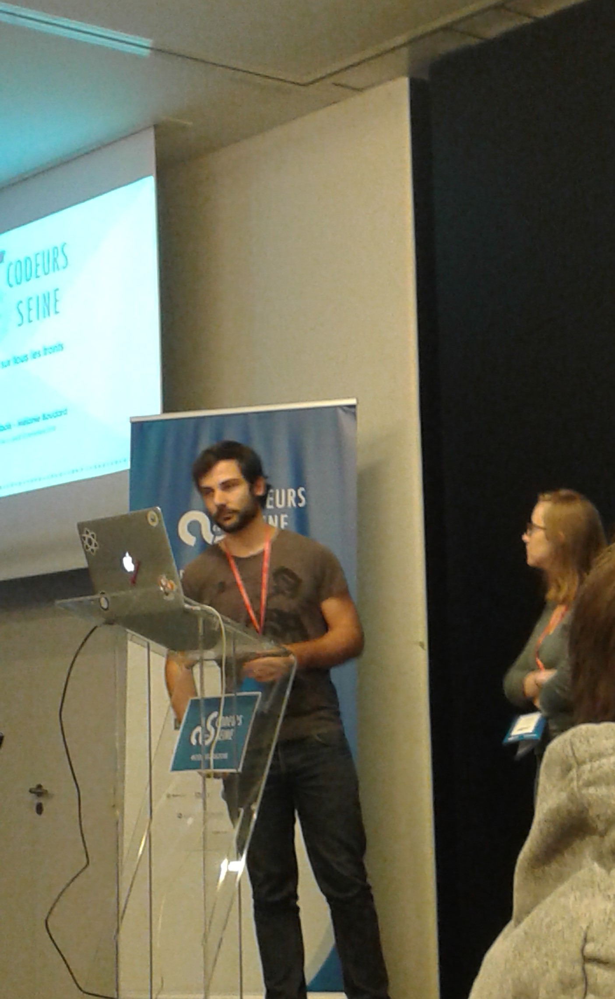

# Titre

## Cartouche d'identification

 - Manifestation : CodeursEnSeine 2018
 - Lieu : Kindarena - Palais des sports de Rouen
 - Conférence : Des tests sur tous les fronts (A27)
 - Horaire de la conférence : 14h10 - 14h25
 - Durée de la conférence : 15 minutes
 - Conférencier(s) :
   - Mélanie BOUDARD ( site officiel : http://melanie.boudard.free.fr/, LinkedIn : linkedin.com/in/mélanie-boudard-0364b521)
   - Clément DUBOIS (Twitter : https://twitter.com/Clement_D, LinkedIn : https://www.linkedin.com/in/cl%C3%A9ment-dubois-8612b6a9/?trk=public-profile-join-page)
 - Audience : Tout public - 110 participants
 - Auteur du billet : Anaëlle MORIN
 - Mots-clés : Maintenabilité, tests, non-régression
 - URL de l'illustration : 

## Support
 - Lien vers le support (diapos) présenté en conférence : Non disponible
 - Nombre de diapos du support : 28
 - Plan du support :
   - Contexte
   - Les différentes types de tests pouvant être mis en place
    - Les tests manuels
    - Les tests automatisés simulant la navigation d'un utilisateur
    - Les tests mockés
    - Les tests d'intégration
    - Les tests unitaires
   - Les tests spécifiques au web
    - Les tests de régression visuel
    - Les tests de performance
    - Les tests d'accessibilité
    - Les tests de SEO
   - Fréquence de lancement des différents types de tests

## Résumé
Devant la complexité de plus en plus importante des applications, la maintenabilité des systèmes devient essentielle. Il est nécessaire de tester pour que le développement se passe au mieux. Différents types de tests existent. Ils ne sont pas à mettre en œuvre pour les mêmes raisons pour en augmenter l'efficacité. Les tests manuels et automatisés de la navigation utilisateur sont longs et fastidieux mais doivent être mis en place pour des parcours critiques. Les tests unitaires et d'intégration doivent être utilisés en plus grand nombre car ils sont plus faciles à mettre en place. 
D'autres tests, plus spécifiques aux applications web, ne doivent pas être mis de côté malgré leur difficulté de mise en oeuvre. Le test de régression visuel permet de vérifier que l'ajout d'une fonctionnalité ne perturbe pas l'aspect visuel de l'application. Le test de performance se concentre sur la vitesse d'apparition des informations à l'écran. Le test d'accessibilité vérifie que l'application est accessible aux malvoyants, daltoniens, et au clavier. Le test de SEO vérifie la structure des données.
La conférence conclut sur la nécessité d'utiliser le bon test au bon moment pour éviter la régression.

## Architecture et facteur qualité
Comme il avait été dit lors de la conférence, le sujet abordé vise à améliorer le facteur maintenabilité (au sens de l'ISO 9126:2001) et plus particulièrement le sous-facteur de la testabilité. En effet, bien connaître les différents types de tests existants permet d'en connaître les avantages et inconvénients et donc les contextes pour lesquels ils sont le plus efficaces. Utiliser les bons tests au bon moment permet de réduire l'effort à fournir pour tester une application ou un système.
